

# FORE TEST AUTOMATION MOBILE POS FRAMEWORK
_ _ _
## Table of Content
- - -
<!-- TOC -->
* [1.1 Schema Framework](#11-schema-framework)
* [1.2 Support libraries:](#12-support-libraries)
    * [1.1.0 Installation:](#110installation)
* [1.3 How To Use:](#13-how-to-use)
    * [1.3.1 Pull Project From GitHub](#131-pull-project-from-github)
    * [1.3.2 Create Branch](#132-create-branch)
    * [1.3.3 Open Project](#133-open-project)
    * [1.3.4 Build Run Config](#134-build-run-configurations)
    * [1.3.5 Run some test script](#135-run-test-script)
    * [1.3.6 Create Report](#136-create-report)
<!-- TOC -->

- - -
## 1.1 Schema Framework
- - -

## 1.2 Support libraries:
- - -
🚀 These features are integrated into the Automation Fore Framework:

| Feature Name  | Function                                                                                                                                              | Support                                                   |
|---------------|:------------------------------------------------------------------------------------------------------------------------------------------------------|-----------------------------------------------------------|
| Appium        | For Mobile Application Automation and Mobile Web Automation                                                                                           | Mobile : Android.  Web: Firefox, Safari, Chrome    |
| Webdriver.io  | As a Framework for Managing Automation Structures                                                                                                     | -                                                         |
| Allure Report | As the automation report utilized after the test script execution is completed                                                                        | -                                                         |
| Video Record  | Used for recording the test steps during execution                                                                                                    | -                                                         |
| Assertion     | Used for comparing values represented as strings                                                                                                      | -                                                         |
| GITHUB ACTION | Utilized to execute cron jobs and CI pipelines                                                                                                        | -                                                         |
| SLACK         | Utilized to receive notifications regarding the automation results, either pass or fail                                                               | -                                                         |                                                         |

### 1.1.0 Installation:
- - -

1. install webstorm for IDE
   [link for download](https://www.jetbrains.com/webstorm/download/?section=mac)
2. install homebrew, node, appium & java.

## 1.3 How To Use
- - -
Pada bagian ini pastikan sudah melakukan registrasi dan sudah masuk dalam project ini. Jika belum terdaftar silahkan melakukan registrasi pada [link ini.](https://github.com/fore-coffee/fore-testing-mobile/tree/develop#)

 - - -
+ #### 1.3.1 Pull Project From GitHub
- - -
1. Copy link project pada tombol bagian "Code",
   lalu pilih "local" dan pilih icon "Copy".  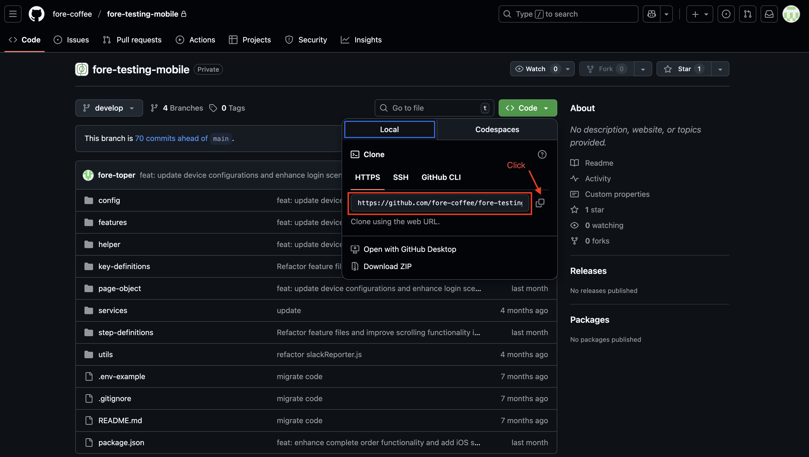
2. Setelah berhasil mengambil source lalu buka Terminal untuk clone project, langkah -langkahnya sebagai berikut:
    - Pertama, buka Terminal.
    - Kedua, ketik "cd" lalu spasi dan salin pathname yang kalian inginkan lalu click enter
    -  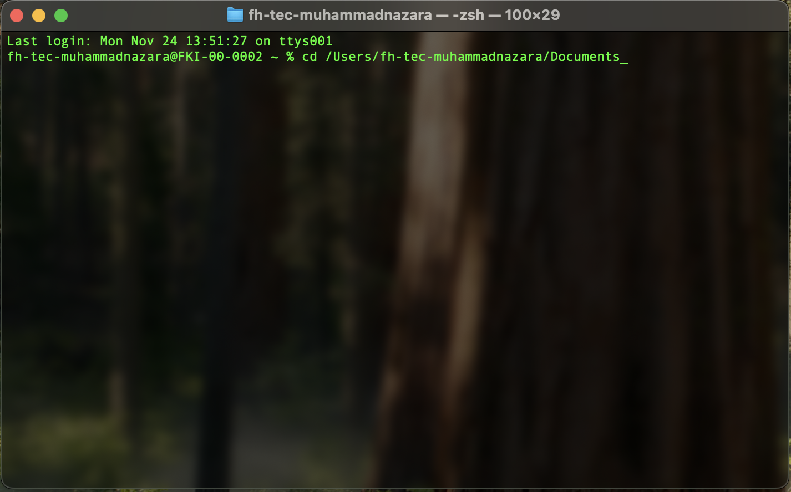
    - Ketiga, ketik git clone [tempelkan source URL dari github] lalu click enter
       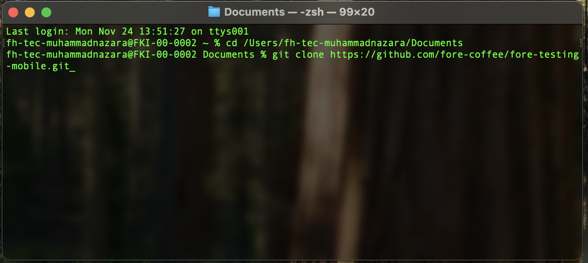
    - Keempat, tunggu selama proses pengambilan data berlangsung, lalu akan secara otomatis akan ter-generate juga untuk source foldernya by defaultnya.
    - Kelima, repository Fore automation berhasil ter-clone ke local laptop anda.
 - - -
+ #### 1.3.2 Create Branch
- - -
1. click Git Branch in the top left corner with Git logo and click New Branch
 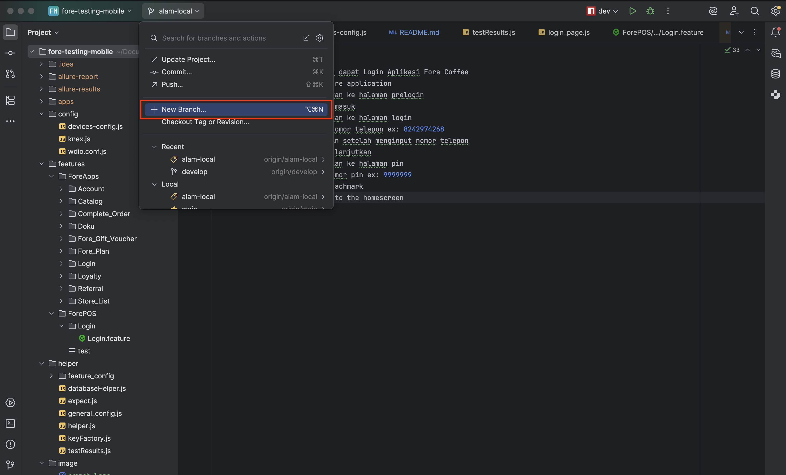
2. naming the branch. It's up to you! (please name it related to what feature want to develope)
    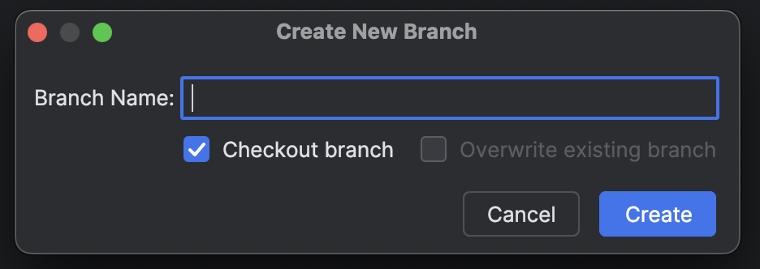

reminder: please don't use space to seperated words!
3. click create
4. click Git Branch once again and click Update Project or pull from dev branch
 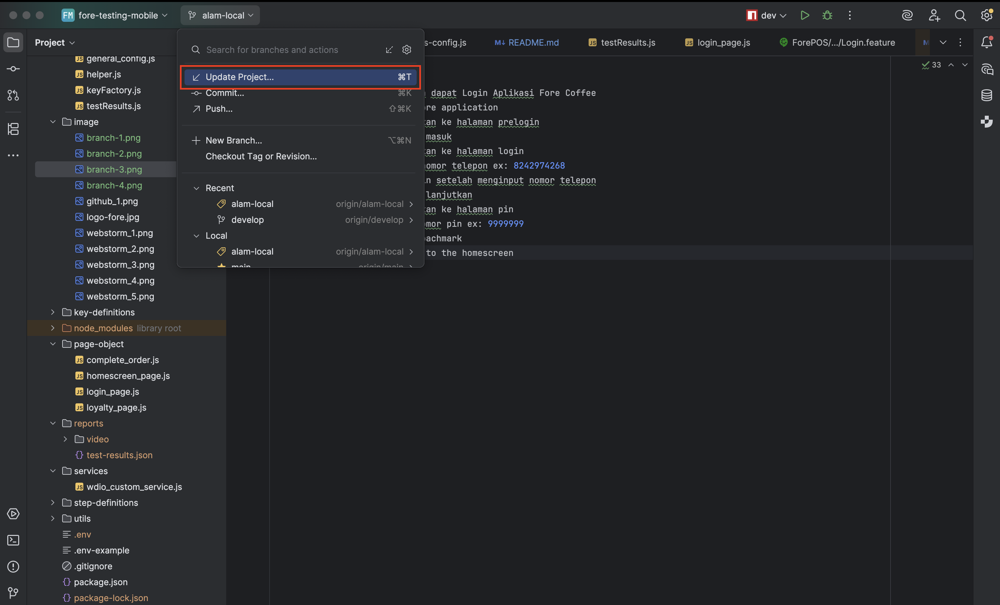

+ #### 1.3.3 Open Project
- - -
To open the project, please open the project that you cloned earlier from GitHub in the WebStorm IDE. Wait for a moment — usually, if you have just cloned the project, it may take some time because the IDE is downloading the required libraries. Make sure your internet connection is stable.

- - -
+ #### 1.3.4 Build Run Configurations
- - - 
1. click Run/Debug configurations icon on top right corner of screen and choose Edit Configurations
 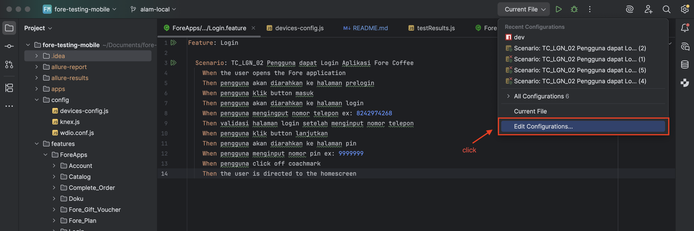
2. click Add icon in the top left corner of popup screen and choose `npm`
 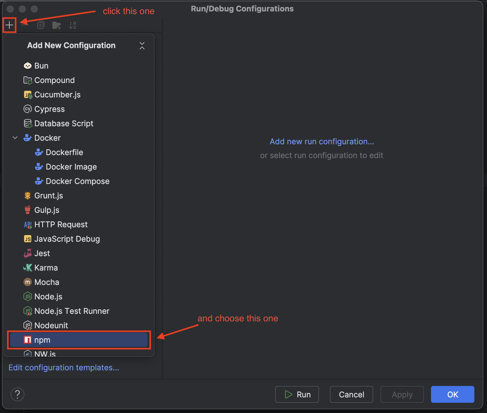
3. input 'dev' on scripts section textbox, click apply and click OK if the apply button is already disabled to click
 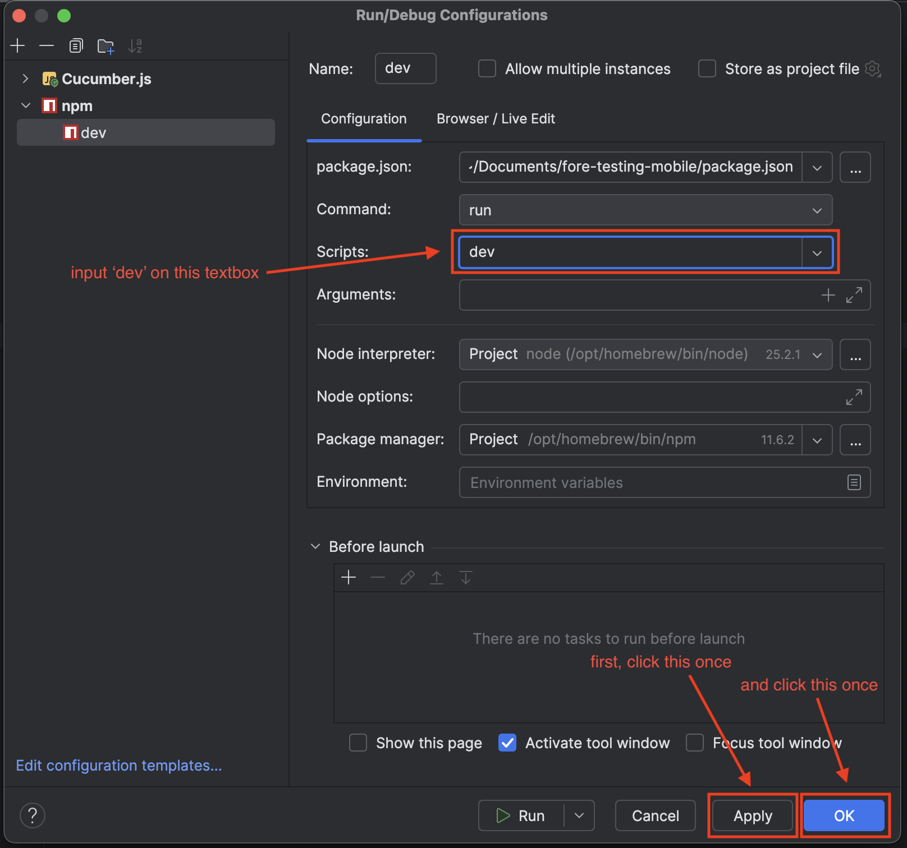

- - -
+ #### 1.3.5 Run test script
- - -
1. click Run/Debug configurations icon on top right corner of screen again and choose configuration npm with label 'dev'
 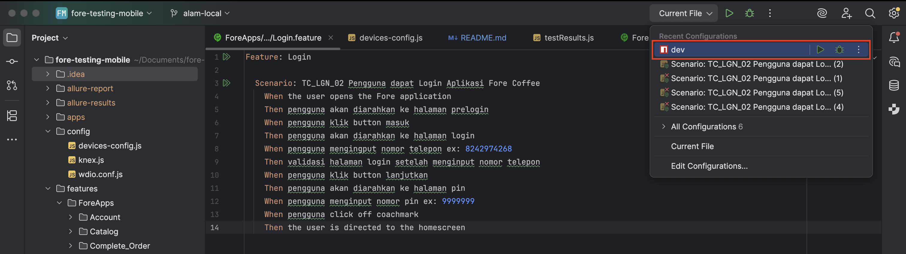
2. User can choose and change the testscript that user want to testing on `device-config.js` which is in specs section
    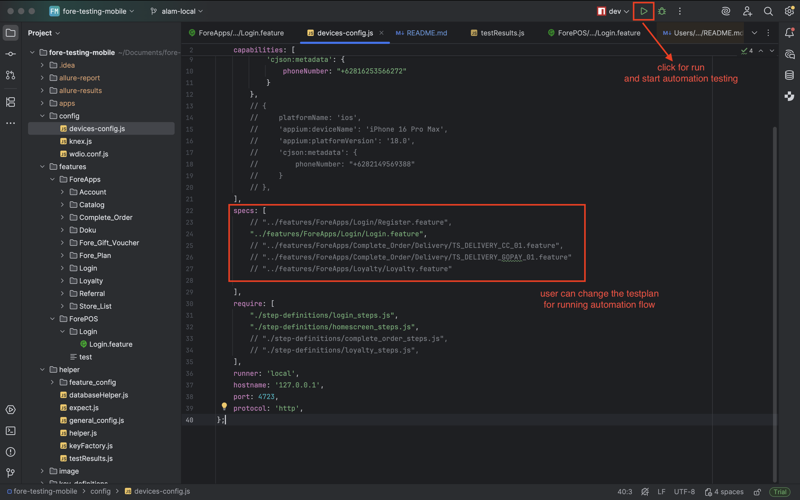

+ #### 1.3.6 Create Report
- - -
To generate an Allure Report, make sure that step 1.3.6 has run successfully, regardless of whether the test status is pass or failed. To create the report, use the command `allure serve` in the WebStorm terminal.
- - -

